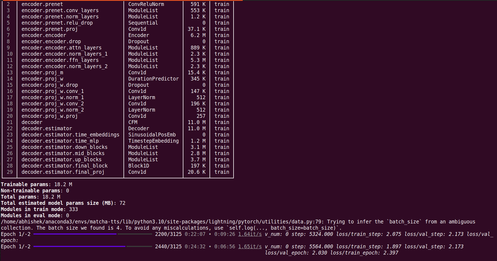

## Building English TTS System using Matcha-TTS

**Author: Abhishek Dey**

## Conda environment setup

```
conda create -n matcha-tts python=3.10 -y

conda activate matcha-tts

```

## Installation

```
git clone https://github.com/shivammehta25/Matcha-TTS.git

cd Matcha-TTS

pip install -e .

pip install --upgrade peft

```

## Download LJ Speech dataset [~2.7 GB]

* Dataset link : [LJ-Speech-Dataset](https://keithito.com/LJ-Speech-Dataset/) 

* extract LJSpeech-1.1.tar.bz2

```
tar -xvjf LJSpeech-1.1.tar.bz2

```

## Train-val-test splits

* The LJ Speech datasat is split into train, val and test sets as follows

 - train 12,500
 - val 100
 - test 500
 
* Download the filelists from [here](https://github.com/NVIDIA/tacotron2/tree/master/filelists)

* Update the wav paths in the files as per the directory structure

**Original path**

```
DUMMY/LJ044-0116.wav|Since he seemed to feel that no one else understood his political views, the letter was of great value to him for it, quote, was proof
DUMMY/LJ021-0058.wav|Under these codes, in the industries covered, child labor has been eliminated.

```

**Updated path**

```
LJSpeech-1.1/wavs/LJ050-0234.wav|Since he seemed to feel that no one else understood his political views, the letter was of great value to him for it, quote, was proof
LJSpeech-1.1/wavs/LJ050-0234.wav|Under these codes, in the industries covered, child labor has been eliminated.

```


## Config update

* Update the paths, batch size and num_workers as per your machine configuration in [Matcha-TTS/configs/data/ljspeech.yaml](https://github.com/shivammehta25/Matcha-TTS/blob/main/configs/data/ljspeech.yaml)

**By default**

```
train_filelist_path: data/LJSpeech-1.1/train.txt
valid_filelist_path: data/LJSpeech-1.1/val.txt
batch_size: 32
num_workers: 20

```

**Updated**

```
train_filelist_path: LJSpeech-1.1/filelists/ljs_audio_text_train_filelist.txt
valid_filelist_path: LJSpeech-1.1/filelists/ljs_audio_text_val_filelist.txt
batch_size: 4
num_workers: 4

```

## Generate normalisation statistics

```

matcha-data-stats -i ljspeech.yaml

```

* output

```
{'mel_mean': -5.517027378082275, 'mel_std': 2.0643975734710693}

```

* update these parameters in [Matcha-TTS/configs/data/ljspeech.yaml](https://github.com/shivammehta25/Matcha-TTS/blob/main/configs/data/ljspeech.yaml)


**By default**

```
data_statistics:  # Computed for ljspeech dataset
  mel_mean: -5.536622
  mel_std: 2.116101

```
**Updated**

```
data_statistics:  # Computed for ljspeech dataset
  mel_mean: -5.517027378082275
  mel_std: 2.0643975734710693

```

## Model Training

```
python matcha/train.py experiment=ljspeech

```

* for a minimum memory run

```
python matcha/train.py experiment=ljspeech_min_memory

```

* for multi-gpu training, run

```

python matcha/train.py experiment=ljspeech trainer.devices=[0,1]

```


<p align="left">

</p>

## Generate TTS using trained model

```
matcha-tts --text "Hi My name is Abhishek" --checkpoint_path eng_ckpt/last.ckpt 

```

## Reference:

* [Matcha-TTS Github repo](https://github.com/shivammehta25/Matcha-TTS)
