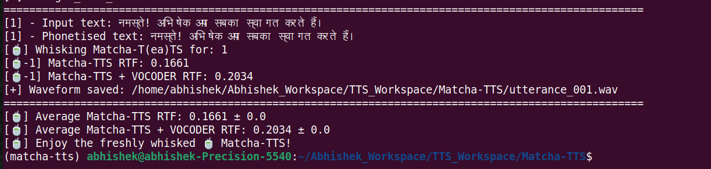

## Building Hindi TTS System using Matcha-TTS

**Author: Abhishek Dey**

## Conda environment setup

```
conda create -n matcha-tts python=3.10 -y

conda activate matcha-tts


```

## Installation

```
git clone https://github.com/shivammehta25/Matcha-TTS.git

cd Matcha-TTS

pip install -e .

pip install --upgrade peft
```

## Download Hindi TTS dataset 

* Download **Hindi_fem_mono** from [Indic TTS Hindi Dataset](https://www.iitm.ac.in/donlab/indictts/database) 

* unzip **Hindi_fem_mono.zip**

```
unzip Hindi_fem_mono.zip

```


## Check the sampling rate of the speech files 

```

for f in Hindi_fem_mono/Hindi_fem_audio/*.wav; do sox --i -r "$f"; done | sort | uniq -c

```
* output

```
     73 44100
   4513 48000

```

## Resample to a common sampling rate: 22050 Hz

* Create the destination folder

```
mkdir -p Hindi_fem_mono/Hindi_fem_audio_22KHz

```

* Loop through all wav files and resample to 22050 Hz

```

for f in Hindi_fem_mono/Hindi_fem_audio/*.wav; do
    filename=$(basename "$f")  # get file name only
    sox "$f" -r 22050 "Hindi_fem_mono/Hindi_fem_audio_22KHz/$filename"
done

```

## Train-val-test splits:

* The hindi TTS datasat is split into train, val and test sets as follows

 - train: 4000 [00001 - 04000]
 - val  : 200  [04001 - 04200]
 - test : 356  [04231 - 04586]

* train split

```
cd Hindi_fem_mono

mkdir -p filelists

cat Hindi_fem_mono.txt | head -n 4000 > filelists/hindi_audio_text_train_filelist.txt

```

* val split

```
cat Hindi_fem_mono.txt | head -n 4200 | tail -n 200 > filelists/hindi_audio_text_val_filelist.txt

```

* test split

```
cat Hindi_fem_mono.txt | tail -n 356 > filelists/hindi_audio_text_test_filelist.txt

```

* For all the train, val, test trascriptions, update the **wav paths** and  do the following replacements

```
train_hindifem -> Hindi_fem_mono/Hindi_fem_audio/train_hindifem

.txt\t -> .wav|

```

**Original path**

```
train_hindifem_00001.txt	मैं जीवन की राह में आगे बढ़ चला . 
train_hindifem_00002.txt	तारीख के दिन मेरे स्वामी जाएँगे और लेदेकर मामला रफ़ादफ़ा हो जाएगा . 
train_hindifem_00003.txt	रॉकेट लांचर से संसद भवन पर मिसाइलें दागी गईं . 

```

**Updated path**

```
Hindi_fem_mono/Hindi_fem_audio_22KHz/train_hindifem_00001.wav|मैं जीवन की राह में आगे बढ़ चला . 
Hindi_fem_mono/Hindi_fem_audio_22KHz/train_hindifem_00002.wav|तारीख के दिन मेरे स्वामी जाएँगे और लेदेकर मामला रफ़ादफ़ा हो जाएगा . 
Hindi_fem_mono/Hindi_fem_audio_22KHz/train_hindifem_00003.wav|रॉकेट लांचर से संसद भवन पर मिसाइलें दागी गईं . 

```


## Configuration files:

* Inside [configs/experiment](configs/experiment) folder, Create the below config files similar to ljspeech

and replace **ljspeech** with **hindi** in all places

```
configs/experiment/hindi.yaml

configs/experiment/hindi_from_durations.yaml

configs/experiment/hindi_min_memory.yaml

```

* Inside [configs/data] folder, create **hindi.yaml**

```
configs/data/hindi.yaml

```

* Update the paths, batch size and num_workers as per your machine configuration in **configs/data/hindi.yaml**


**Updated**

```
name: hindi
train_filelist_path: Hindi_fem_mono/filelists/hindi_audio_text_train_filelist.txt
valid_filelist_path: Hindi_fem_mono/filelists/hindi_audio_text_val_filelist.txt
sample_rate: 22050
cleaners: [hindi_cleaners]

```

## Get uniq characters in the text

```
python3 extract_uniq_characters.py Hindi_fem_mono/Hindi_fem_mono.txt

```

* Add the extracted uniq characters in **_hindi_trans** as below in [macha/text/symbols.txt](macha/text/symbols.txt)

```
_pad = "_"
_punctuation = '।,!? '   # danda, punctuation, space
_hindi_letters = "अआइईउऊऋएऐओऔअंअःकखगघङचछजझञटठडढणतथदधनपफबभमयरलवशषसह"
_hindi_matras = "ािीुूृेैोौंःँ'्."   # vowel signs, anusvara, visarga, chandrabindu
_digits = "०१२३४५६७८९"
_hindi_trans = ".ँंःअआइईउऊऋएऐऑओऔकखगघङचछजझञटठडढणतथदधनपफबभमयरऱलवशषसह़ािीुूृॅेैॉोौ्क़ख़ग़ज़ड़ढ़फ़‍"

symbols = [_pad] + list(_punctuation) + list(_hindi_letters) + list(_hindi_matras) + list(_digits) + list(_hindi_trans)

SPACE_ID = symbols.index(" ")

```


## Add hindi cleaners [macha/text/cleaners.py](macha/text/cleaners.py)

* Append below **hindi_cleaners** function to 
```
def hindi_cleaners(text):
    """Cleaner for Hindi text (Devanagari script)."""
    text = collapse_whitespace(text)  # keep only one space
    text = remove_brackets(text)      # optional, removes []
    return text

```

## Generate normalisation statistics with the yaml file of dataset configuration

```

matcha-data-stats -i hindi.yaml

```

* output

```
{'mel_mean': -5.221494197845459, 'mel_std': 2.787169933319092}

```

* update these parameters in **configs/data/hindi.yaml**

**Updated config**

```
_target_: matcha.data.text_mel_datamodule.TextMelDataModule
name: hindi
train_filelist_path: Hindi_fem_mono/filelists/hindi_audio_text_train_filelist.txt
valid_filelist_path: Hindi_fem_mono/filelists/hindi_audio_text_val_filelist.txt
batch_size: 4
num_workers: 4
pin_memory: True
cleaners: [hindi_cleaners]
add_blank: True
n_spks: 1
n_fft: 1024
n_feats: 80
sample_rate: 22050
hop_length: 256
win_length: 1024
f_min: 0
f_max: 8000
data_statistics:  # Computed for hindi dataset
  mel_mean: -5.221494197845459
  mel_std: 2.787169933319092
seed: ${seed}
load_durations: false

```

## Model Training

```
python matcha/train.py experiment=hindi

```

* for a minimum memory run

```
python matcha/train.py experiment=hindi_min_memory

```

* for multi-gpu training, run

```

python matcha/train.py experiment=hindi trainer.devices=[0,1]

```
## For inference, modify one line in cli.py


* Replace **english_cleaners2** in  line 51: [matcha/cli.py](matcha/cli.py)

```
intersperse(text_to_sequence(text, ["english_cleaners2"])[0], 0),

```

* To **hindi_cleaners**

```
intersperse(text_to_sequence(text, ["hindi_cleaners"])[0], 0),

```

## Generate TTS using trained model


```
matcha-tts --text "नमस्ते! अभिषेक आप सबका स्वागत करते हैं।" --checkpoint_path hindi_ckpt_150ep/last.ckpt  --vocoder hifigan_univ_v1

```

<p align="left">

</p>


## Reference:

* [Matcha-TTS Github repo](https://github.com/shivammehta25/Matcha-TTS)
